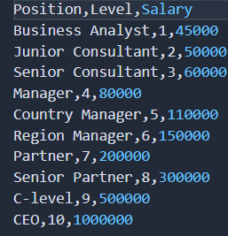
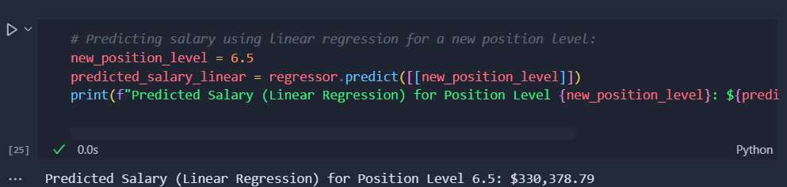
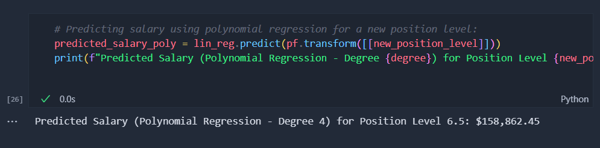
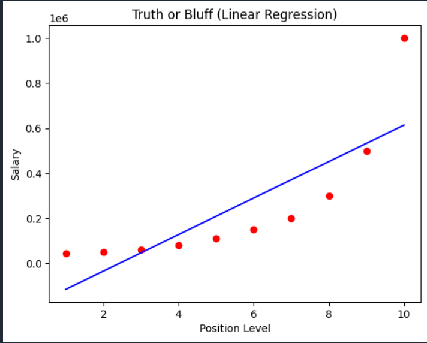
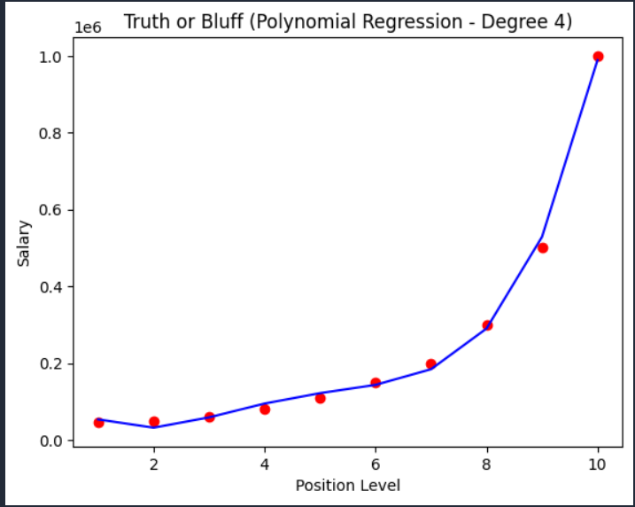
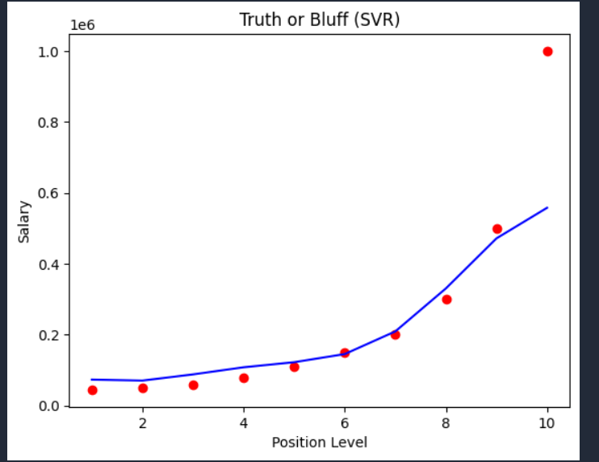

# Salary Truth Predictor: Truth Identification using Polynomial Regression and Support Vector Regression (SVR)
### A Supervised Machine Learning Regression Model
## Problem Statement
As a member of the HR department, you are tasked with hiring a new employee who claims an expected salary of $160,000 per year based on their previous experience as a region manager. Your goal is to verify the truthfulness of this claim using a dataset that includes positions, levels, and corresponding salaries from their previous company.

The dataset indicates that region managers typically earn between $150,000 and $200,000 annually (levels 6-7). Based on the candidate's 2-year experience as a region manager, you estimate their position level to be around 6.5.

You aim to evaluate whether the candidate's salary expectation aligns with their experience using polynomial regression. The project involves training both linear and polynomial regression models on the dataset to compare their effectiveness in predicting the candidate's expected salary and determining if the candidate is bluffing or telling the truth.

## Solution Overview
Steps in the Solution:
* `Data Loading and Preprocessing`:

Load the dataset (`Position_Salaries.csv`) using pandas to extract position levels (`x`) and corresponding salaries (`y`).

* `Linear Regression Model`:

Train a LinearRegression model from `sklearn.linear_model` to capture the linear relationship between position levels and salaries.

* `Polynomial Regression Model`:

Use PolynomialFeatures from `sklearn.preprocessing` to transform the features (`x`) into polynomial features of degree 4 (degree=4).
Train a new LinearRegression model on the polynomial features (`x_poly`) to model the non-linear relationship between position levels and salaries.

* `Support Vector Regression (SVR) with RBF Kernel`:

Scale the features and target variable using `StandardScaler` from `sklearn.preprocessing`.
Train an SVR model from `sklearn.svm` with an RBF kernel to capture the non-linear relationship between position levels and salaries.

* `Visualization`:

Plot the actual data points and the regression line for both linear, polynomial, and SVR models using `matplotlib.pyplot`. This visualization helps in comparing the predictions of all models.

* `Prediction and Truth Evaluation`:

Predict the expected salary for a position level of 6.5 using the linear, polynomial, and SVR models.
Compare the predicted salary against the candidate's claimed salary of $160,000 to determine if the candidate is telling the truth or bluffing.

### Usage

* Ensure Python is installed along with the necessary libraries listed in requirements.txt.
* Run the Python script truth_or_bluff_polynomial_regression.py in a Jupyter Notebook or any Python environment.
* Review the generated plots to visually assess the predictions from linear, polynomial, and SVR models.
* Check the printed output to see if the predicted salary aligns with the candidate's salary expectation, helping in decision-making during the    hiring process.

* `Note`: A Jupyter Notebook is also included in the "model" folder. If you prefer to use the Jupyter Notebook, you don't need to install `requirements.txt` separately.

### Screenshots

#### Dataset

#### Predicted Salary using Linear Regression

#### Predicted Salary using Polynomial Regression

#### Truth or Bluff (Linear Regression)

#### Truth or Bluff (Polynomial Regression)

#### Truth or Bluff (SVR)

### Directories Included
* `images`: Folder containing images provided in the README.
* `dataset`: Containing the CSV file which has the dataset of positions, levels and corresponding salaries from the candidate's previous company.
* `model`: Folder containing the Python file for data loading, preprocessing, model training, visualization, and prediction. There is also a Jupyter Notebook version of the script for interactive use.

### Conclusion
This project demonstrates the application of polynomial regression and SVR with an RBF kernel to validate a candidate's salary expectation based on previous company data.

By training the polynomial regression and SVR models, you can assess whether the candidate's salary claim aligns with their experience as a region manager (You can also change the level to assess another candidate outside the problem statement).

This helps in making informed decisions during salary negotiations and hiring processes.

(The features and dependent variable were trained under Linear, Polynomial, and SVR models to evaluate the differences in training a model based on data that doesn't have any linear correlation between them.)